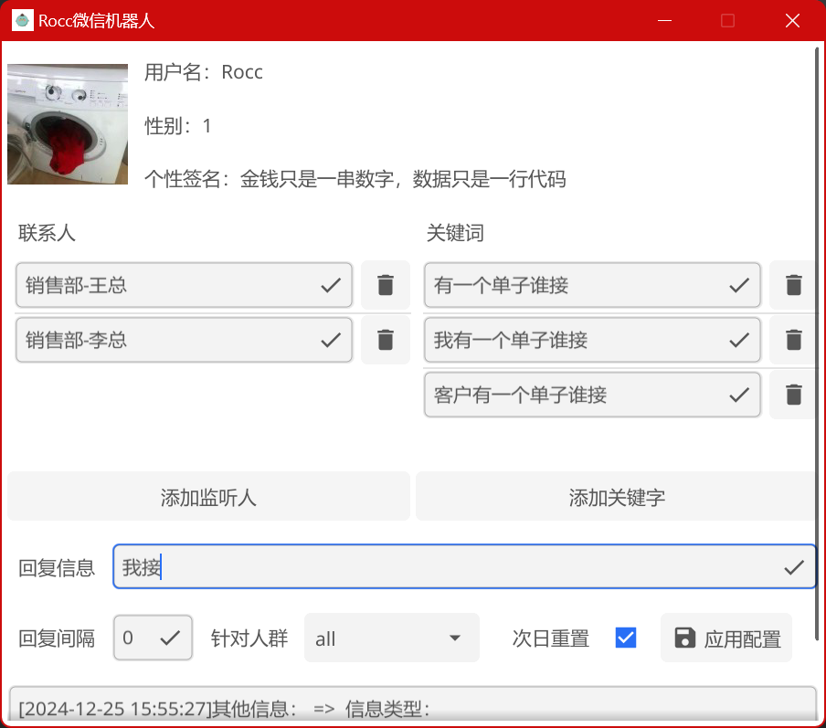
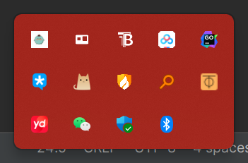

# Fyne-Wechat 微信机器人

---

> 这是我一个销售朋友想让我做一个微信抢单回复的机器人程序，所以有了本项目
> 
> 免责声明：本项目是为了学习golang从而编写的程序，如果存在争议可练习我进行删除
> 
> 邮箱：dpengchen@163.com

## 功能介绍

---

1. 支持对 `好友、群组` 进行消息监听，可对监听对象进行配置；
2. 支持对指定关键字进行匹配，匹配成功则回复对应信息。
3. 回复间隔，当遇到指定信息之后是需要间隔回复；次日是否重置回复。
4. 日志打印日志记录
5. 支持后台运行

## 应用截图

---

